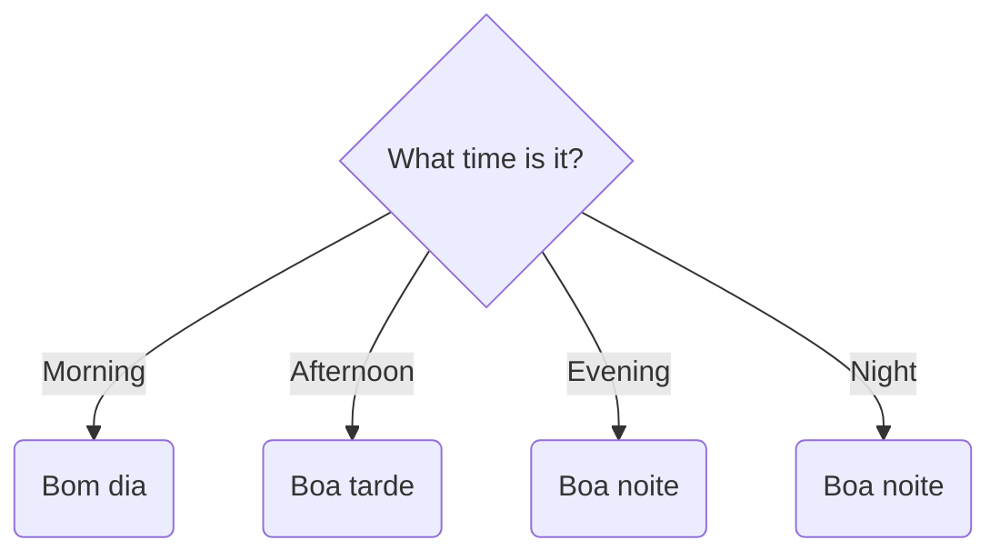
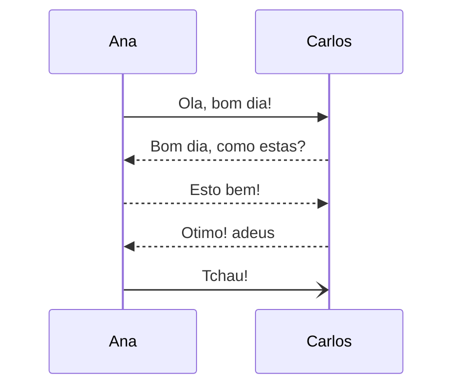

# Greetings

Greetings are a way of expressing yourself when you start or finish a conversation. The right greeting should be chosen based on the **familiarity** with the person / people in your conversation and **time of day**.

## General greetings

- Ola
- Tchau
- Adeus
- Ate logo
- Ate manha

## Time-based greetings

These greetings are for casual and formal familiarity.

## Slang greetings

## Question greetings

## Example Conversation

