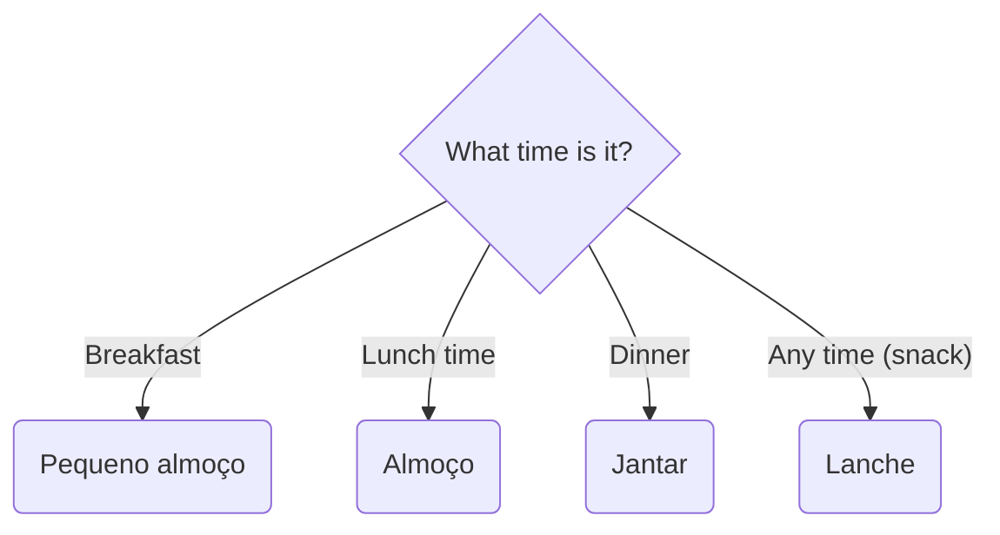

# Foods

Portuguese food and meals.

## Meals

## Foods

### Pequeno almoço

| Portuguese       | English                                 |
| ---------------- | --------------------------------------- |
| os cereais       | cereals                                 |
| o leite          | milk                                    |
| o pão            | bread                                   |
| a manteiga       | butter                                  |
| o iogurte        | joghurt                                 |
| o café           | coffee                                  |
| o croissant      | criossant                               |
| as torradas      | toasts                                  |
| a nata           | nata                                    |
| a bola de berlim | berlin donut                            |
| o sumo           | juice                                   |
| a fruta          | fruit                                   |
| café com leite   | coffee with milk                        |
| café simples     | espresso                                |
| meia de leite    | half half coffee and milk               |
| galão            | coffee half half with milk in glass cup |
| descafeinado     | decaffeinated                           |

### Almoço

| Portuguese | English  |
| ---------- | -------- |
| o pão      | bread    |
| a sopa     | soup     |
| o arroz    | rice     |
| a batata   | potatoes |
| o feijão   | beans    |
| o peixe    | fish     |
| o carne    | meat     |
| o vinho    | wine     |
| a água     | water    |

### Jantar

| Portuguese | English  |
| ---------- | -------- |
| o pão      | bread    |
| a sopa     | soup     |
| o arroz    | rice     |
| a batata   | potatoes |
| o peixe    | fish     |
| o carne    | meat     |

### Lanche

| Portuguese | English |
| ---------- | ------- |
| o pão      | bread   |
| a balacha  | buscuit |
| a banana   | banana  |
| a maçã     | apple   |
