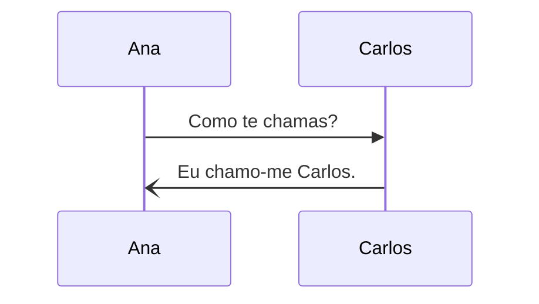

# Reflexive Verbs

Reflexive verbs are used when the verb is acting on itself. In English this would done with the words _myself_, _yourself_, _himself_, _ourselves_, and _themselves_.

## Example - Chamar-se

## Structure

Reflexive verbs are made up of two parts.

1. Verb (eg chamar)
2. Reflexive pronoun (eg me)

| Reflexive pronoun | Use when subject pronoun is ...        | Example               |
| ----------------- | -------------------------------------- | --------------------- |
| me                | eu                                     | eu chamo-me Carlos    |
| te                | tu                                     | tu chamas-te Ana      |
| se                | ele / ela / você / eles / elas / vocês | ele chama-se Rita     |
| nos               | nós                                    | nós chamamo-nos galos |

## Word Order Rules

:::tip

Notice in this example that the order of the verb can be in two directions, **te chamas** and **chamo-me**.

:::

There are two possibilities;

1. _verb_-_reflexive-pronoun_ - standard usage (eg. chamo-me)
2. _reflexive-pronoun_ _verb_ - use in the following situations (eg me chamo);

- When a question is being asked (_quem_, _qual_, _onde_, etc)
- When the verb is negated (eg. não me levanto às 7h00)
- When after frequency words (_sempre_, _raramente_, _nunca_, etc)
- When after special words (_já_, _ainda_, _só_, _também_, _que_, _porque_, _todos_)

## Common Reflexive Verbs

### Regular

**deitar-se** - to go to bed

| Pronoun             | Verb Conjugation |
| ------------------- | ---------------- |
| eu                  | deito-me         |
| tu                  | deitas-te        |
| ele / ela / você    | deita-se         |
| nós                 | deitamo-nos      |
| eles / elas / vocês | deitam-se        |

**banhar-se** - to bathe oneself

| Pronoun             | Verb Conjugation |
| ------------------- | ---------------- |
| eu                  | banho-me         |
| tu                  | banhas-te        |
| ele / ela / você    | banha-se         |
| nós                 | banhamo-nos      |
| eles / elas / vocês | banham-se        |

**levantar-se** - to get up

| Pronoun             | Verb Conjugation |
| ------------------- | ---------------- |
| eu                  | levanto-me       |
| tu                  | levantas-te      |
| ele / ela / você    | levanta-se       |
| nós                 | levantamo-nos    |
| eles / elas / vocês | levantam-se      |

### Irregular

**vestir-se** - to dress up

| Pronoun             | Verb Conjugation |
| ------------------- | ---------------- |
| eu                  | visto-me         |
| tu                  | vestes-te        |
| ele / ela / você    | veste-se         |
| nós                 | vestimo-nos      |
| eles / elas / vocês | vestem-se        |

**lavar-se** - to wash

| Pronoun             | Verb Conjugation |
| ------------------- | ---------------- |
| eu                  | lavo-me          |
| tu                  | lavas-te         |
| ele / ela / você    | lava-se          |
| nós                 | lavamo-nos       |
| eles / elas / vocês | lavam-se         |

**queixar-se** - to complain

| Pronoun             | Verb Conjugation |
| ------------------- | ---------------- |
| eu                  | queixo-me        |
| tu                  | queixas-te       |
| ele / ela / você    | queixa-se        |
| nós                 | queixamo-nos     |
| eles / elas / vocês | queixam-se       |
