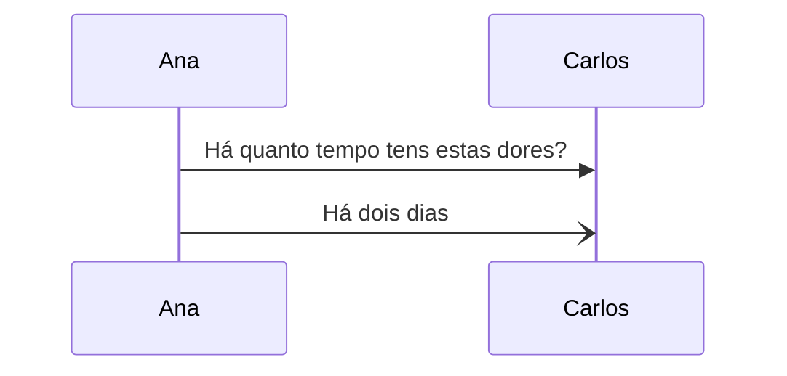
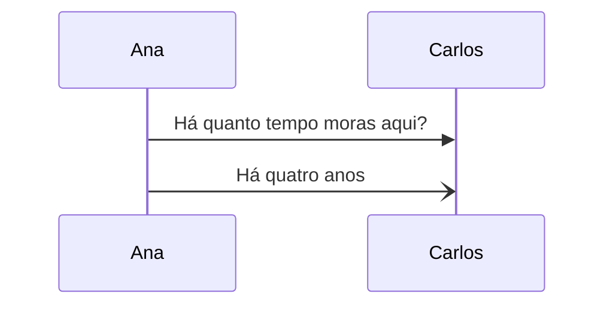
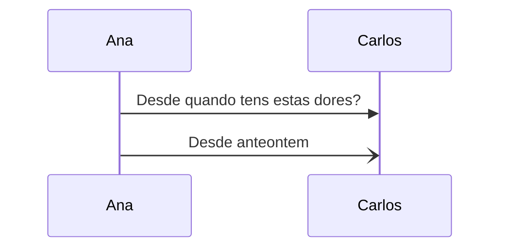
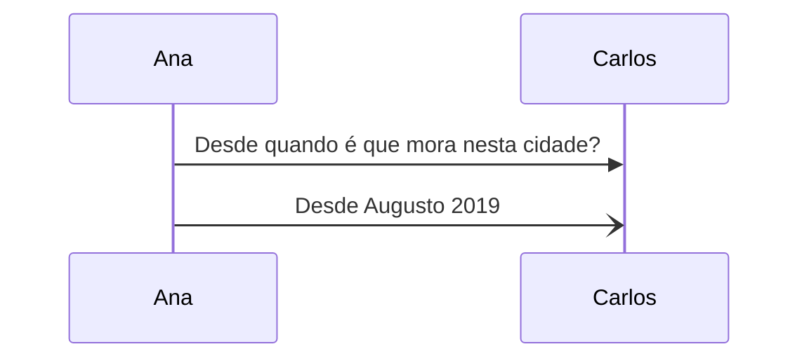

# How long?

Questions and responses about how much time has passed.

## Há quanto tempo

**Há quanto tempo** means _how long since ..._

The expected response will be a duration, for example;

- since 2 days
- since 4 years

The response in Portuguese will start with **Há**.

### Example questions and responses

## Desde quando

**Desde quando** means _Since when ..._

The expected response will be a specific timeframe, for example;

- since the day before yesterday
- since August 2019

The response in Portuguese will start with **Desde**.

### Example questions and responses

