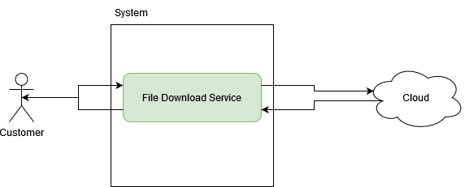
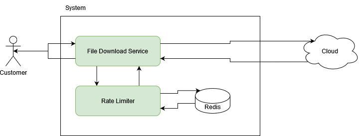

# Rate Limiter

A rate limiter is a piece of software that can limit the number of requests to a specific url by IP address to prevent abuse of endpoints.

## Requirements Exploration

Developer: Tell me about the problem you are having.

Stakeholder: We have been having trouble with abuse on our file download endpoints. As a result of this we have received a very high cloud services bill this month. We need to put measures in place to reduce the abuse on our endpoints.

Developer: As our site requires access to these download endpoints without having to have an account, why don't we discuss adding a rate limiter to our endpoints. This would restrict the number of requests per IP over a set time period.

Stakeholder: This sounds like a great start, what do you need to know.

Developer: Shall we rate limit downloads per file or globally?

Stakeholder: Can you explain what the difference is?

Developer: Both have their pros and cons.

- Per file: If we limit per file then a customer can still download multiple files without being blocked by the rate limiter. But an abuser could download every file in our system in a loop to get around the rate limiter.
- Globally: If we limit globally then a customer could be rate limited if they need to download a batch of files. An abuser would have a harder time of getting around the rate limiter.

Stakeholder: From our observation of the cloud service logs, the latest abuse attack was quite basic and only downloaded the same files over and over. I would prefer to give our customers a better experience so they are not accidentaly rate limited and go with the **per file** approach. If we observe the attack becoming more sophisticated, we can adapt the rate limiter.

Developer: Great, how many downloads per file do you think is acceptable per a 15 minute window.

Stakeholder: Let's allow 5 downloads per file every minute, just to give a small buffer in case the customer makes a few mistakes while downloading a file.

Developer: What shall happen if the customer reaches the rate limit?

Stakeholder: We should return a simple error message and explain for them to try again in 15 minutes.

Developer: Sounds good. Let's summarise the requirements:

- Customers are identified by IP address
- Each IP address can download each file up to 5 times per 1 minute
- A simple error page should be shown if the rate limit is reached

## Architecture / High Level Design

### Current design



### Proposed design



### Calculations

Storage:

- Redis will store a counter per key
- Counter value is a 64 bit integer = 8 bytes
- Key is a string
- -- IP:file_id
- -- IP needs 16 bytes
- -- file_id needs 16 bytes
- Total memory per customer per file is 8 + 16 + 16 = 40 bytes
- Add some buffer for Redis would be 50 bytes total

Customers:

- If we assume 1 million customer/downloads per day
- 50 bytes times 1,000,000 = 50,000,000 bytes = 50,000 KB = 50 MB RAM needed per day
- Even if a customer downloads multiple times the same file per minute then there is no impact on RAM.

## Data Model

We need to store each download request so we can compare if the customer has reached the rate limit.

As the rate limiter check should have minimal impact on network performance, we will use a Redis store.

Redis structure:

```yaml
SETNX caller_ip:file_id limit_amount

Example: SETNX 203.123.123.123:1DF321BA1 10
```

Set a timeout limit:

```yaml
EXPIRE caller_ip:file_id timeout

Example: EXPIRE 203.123.123.123:1DF321BA1 60000
```

Decrease the limit amount per ip and file id

```yaml
DECRBY caller_ip:file_id amount

Example: DECRBY 203.123.123.123:1DF321BA1 1
```

Get the current limit count per ip and file id

```yaml
GET caller_ip:file_id

Example: GET 203.123.123.123:1DF321BA1
```

## Interface Definition (API)

The rate limiter will be inserted at the API layer of the microservice that handles file downloads.

Customer -> [File Download Service] -> [Rate Limited] -> (Cloud)

File Download Service:

- Get user ip from request headers
- Get file id from url
- Construct a Rate Limiter instance using (ip, file_id)
- Call rate limiter instance to check if request is allowed

Rate Limiter:

- Get current value from redis
- If value `<=` 0
- -- reject download request
- Else
- -- decrease counter in redis
- allow download request

File Download Service:

- If rate limiter instance allows download request
- -- continue code to download and return file from cloud services
- Else
- -- return 429 HTTP response with simple error page HTML content

After 1 minute the key in Redis will expire and be removed and any new download will start again with a fresh 5 downloads available per file

## Optimizations and Deep Dive

This rate limiter is specific for file downloads, but it could be applied at the load balancer level to make it apply to any url request.

The main issue with this, is that some urls need multiple downloads within a short time and the restrictions could be too generic if applied like above.

The use of Redis allows for a distributed control of the rates. If we didn't use Redis and instead only stored the rate limits in memory of the running service, then the rates would be per service that is hit and if we spin up multiple instances of the service then the rates would be much higher than expected.
